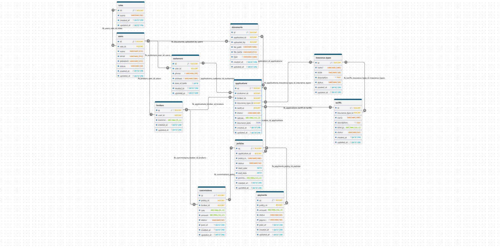

# Insurance broker platform Diagram documentation
## Summary

- [Introduction](#introduction)
- [Database Type](#database-type)
- [Table Structure](#table-structure)
	- [roles](#roles)
	- [users](#users)
	- [customers](#customers)
	- [brokers](#brokers)
	- [insurance_types](#insurance_types)
	- [tariffs](#tariffs)
	- [applications](#applications)
	- [documents](#documents)
	- [policies](#policies)
	- [payments](#payments)
	- [commissions](#commissions)
- [Relationships](#relationships)
- [Database Diagram](#database-diagram)

## Introduction

Данная база данных спроектирована для обеспечения работы **Информационной системы страхового брокера (Insurance Broker Information System)**. Архитектура построена с учетом требований реляционной нормализации, строгой типизации финансовых данных и гибкости, необходимой для интеграции с модулем интеллектуального анализа (NLP/AI).

Ниже представлена визуальная структура базы данных (ER-диаграмма), сгенерированная с помощью синтаксиса Mermaid.

### Ключевые архитектурные решения:

*   **Хранение неструктурированных данных (NLP):** Таблица `applications` содержит поле `insurance_data` типа `JSON`[cite: 1]. Это позволяет сохранять динамические параметры, сырые данные распознанных документов и извлеченные NLP-модулем сущности без необходимости менять жесткую схему БД.
*   **Изоляция профилей (Separation of Concerns):** Общие авторизационные данные вынесены в таблицу `users`, которая связана связью `one_to_one` с конкретными профилями участников — `customers` и `brokers`[cite: 1]. Это упрощает аутентификацию и позволяет расширять типы пользователей в будущем.
*   **Финансовая точность:** Для хранения денежных сумм (поля `calculated_price`, `premium`, `amount`) используется тип `DECIMAL(12,2)`, а для процентных ставок (`commission_rate`, `rate`) — `DECIMAL(5,2)`[cite: 1]. Использование чисел с фиксированной точкой критически важно для предотвращения ошибок округления при расчетах стоимости полисов и брокерских комиссий.
*   **Ролевая модель:** Базовый контроль доступа (RBAC) реализован через таблицу `roles` и связь `many_to_one` с таблицей `users`[cite: 1].

### Основные бизнес-домены:

Схема разделена на 4 логических модуля, состоящих из 11 таблиц[cite: 1]:
1.  **Управление доступом (Identity & Access):** `roles`, `users`, `customers`, `brokers`[cite: 1].
2.  **Каталог продуктов (Product Catalog):** `insurance_types` (виды страхования), `tariffs` (тарифные сетки)[cite: 1].
3.  **Бизнес-операции (Core Operations):** `applications` (входящие заявки от клиентов) и `documents` (загруженные файлы и сканы)[cite: 1].
4.  **Оформление и финансы (Finance):** `policies` (выпущенные страховые полисы), `payments` (история транзакций), `commissions` (расчет вознаграждений брокерам)[cite: 1].

## Схема базы данных

Ниже представлена визуальная ERD-диаграмма базы данных:


## Database type

- **Database system:** MySQL

## Table structure

### roles

| Name           | Type        | Settings                   | References | Note |
| -------------- | ----------- | -------------------------- | ---------- | ---- |
| **id**         | BIGINT      | 🔑 PK, null, autoincrement |            |      |
| **name**       | VARCHAR(50) | not null, unique           |            |      |
| **created_at** | DATETIME    | null                       |            |      |
| **updated_at** | DATETIME    | null                       |            |      | 


### users

| Name           | Type         | Settings                   | References             | Note |
| -------------- | ------------ | -------------------------- | ---------------------- | ---- |
| **id**         | BIGINT       | 🔑 PK, null, autoincrement |                        |      |
| **role_id**    | BIGINT       | not null                   | fk_users_role_id_roles |      |
| **name**       | VARCHAR(255) | not null                   |                        |      |
| **email**      | VARCHAR(255) | not null, unique           |                        |      |
| **password**   | VARCHAR(255) | not null                   |                        |      |
| **status**     | VARCHAR(50)  | not null, default: active  |                        |      |
| **created_at** | DATETIME     | null                       |                        |      |
| **updated_at** | DATETIME     | null                       |                        |      | 


### customers

| Name              | Type         | Settings                   | References                 | Note |
| ----------------- | ------------ | -------------------------- | -------------------------- | ---- |
| **id**            | BIGINT       | 🔑 PK, null, autoincrement |                            |      |
| **user_id**       | BIGINT       | not null, unique           | fk_customers_user_id_users |      |
| **phone**         | VARCHAR(30)  | null                       |                            |      |
| **address**       | VARCHAR(500) | null                       |                            |      |
| **date_of_birth** | DATE         | null                       |                            |      |
| **created_at**    | DATETIME     | null                       |                            |      |
| **updated_at**    | DATETIME     | null                       |                            |      | 


### brokers

| Name                | Type         | Settings                   | References               | Note |
| ------------------- | ------------ | -------------------------- | ------------------------ | ---- |
| **id**              | BIGINT       | 🔑 PK, null, autoincrement |                          |      |
| **user_id**         | BIGINT       | not null, unique           | fk_brokers_user_id_users |      |
| **commission_rate** | DECIMAL(5,2) | not null, default: 0.00    |                          |      |
| **created_at**      | DATETIME     | null                       |                          |      |
| **updated_at**      | DATETIME     | null                       |                          |      | 


### insurance_types

| Name            | Type         | Settings                   | References | Note |
| --------------- | ------------ | -------------------------- | ---------- | ---- |
| **id**          | BIGINT       | 🔑 PK, null, autoincrement |            |      |
| **name**        | VARCHAR(100) | not null                   |            |      |
| **code**        | VARCHAR(50)  | not null, unique           |            |      |
| **description** | TEXT         | null                       |            |      |
| **status**      | VARCHAR(50)  | not null, default: active  |            |      |
| **created_at**  | DATETIME     | null                       |            |      |
| **updated_at**  | DATETIME     | null                       |            |      | 


### tariffs

| Name                  | Type          | Settings                   | References                                   | Note |
| --------------------- | ------------- | -------------------------- | -------------------------------------------- | ---- |
| **id**                | BIGINT        | 🔑 PK, null, autoincrement |                                              |      |
| **insurance_type_id** | BIGINT        | not null                   | fk_tariffs_insurance_type_id_insurance_types |      |
| **name**              | VARCHAR(100)  | not null                   |                                              |      |
| **description**       | TEXT          | null                       |                                              |      |
| **base_price**        | DECIMAL(12,2) | not null, default: 0.00    |                                              |      |
| **status**            | VARCHAR(50)   | not null, default: active  |                                              |      |
| **created_at**        | DATETIME      | null                       |                                              |      |
| **updated_at**        | DATETIME      | null                       |                                              |      | 


### applications

| Name                  | Type          | Settings                   | References                                        | Note |
| --------------------- | ------------- | -------------------------- | ------------------------------------------------- | ---- |
| **id**                | BIGINT        | 🔑 PK, null, autoincrement |                                                   |      |
| **customer_id**       | BIGINT        | not null                   | fk_applications_customer_id_customers             |      |
| **broker_id**         | BIGINT        | not null                   | fk_applications_broker_id_brokers                 |      |
| **insurance_type_id** | BIGINT        | not null                   | fk_applications_insurance_type_id_insurance_types |      |
| **tariff_id**         | BIGINT        | not null                   | fk_applications_tariff_id_tariffs                 |      |
| **status**            | VARCHAR(50)   | not null, default: new     |                                                   |      |
| **calculated_price**  | DECIMAL(12,2) | not null                   |                                                   |      |
| **insurance_data**    | JSON          | not null                   |                                                   |      |
| **created_at**        | DATETIME      | null                       |                                                   |      |
| **updated_at**        | DATETIME      | null                       |                                                   |      | 


### documents

| Name               | Type         | Settings                   | References                               | Note |
| ------------------ | ------------ | -------------------------- | ---------------------------------------- | ---- |
| **id**             | BIGINT       | 🔑 PK, null, autoincrement |                                          |      |
| **application_id** | BIGINT       | not null                   | fk_documents_application_id_applications |      |
| **uploaded_by**    | BIGINT       | not null                   | fk_documents_uploaded_by_users           |      |
| **file_path**      | VARCHAR(500) | not null                   |                                          |      |
| **file_name**      | VARCHAR(255) | not null                   |                                          |      |
| **type**           | VARCHAR(100) | null                       |                                          |      |
| **created_at**     | DATETIME     | null                       |                                          |      |
| **updated_at**     | DATETIME     | null                       |                                          |      | 


### policies

| Name               | Type          | Settings                           | References                              | Note |
| ------------------ | ------------- | ---------------------------------- | --------------------------------------- | ---- |
| **id**             | BIGINT        | 🔑 PK, null, autoincrement         |                                         |      |
| **application_id** | BIGINT        | not null, unique                   | fk_policies_application_id_applications |      |
| **policy_number**  | VARCHAR(100)  | not null, unique                   |                                         |      |
| **status**         | VARCHAR(50)   | not null, default: pending_payment |                                         |      |
| **start_date**     | DATE          | not null                           |                                         |      |
| **end_date**       | DATE          | not null                           |                                         |      |
| **premium**        | DECIMAL(12,2) | not null                           |                                         |      |
| **created_at**     | DATETIME      | null                               |                                         |      |
| **updated_at**     | DATETIME      | null                               |                                         |      | 


### payments

| Name               | Type          | Settings                   | References                     | Note |
| ------------------ | ------------- | -------------------------- | ------------------------------ | ---- |
| **id**             | BIGINT        | 🔑 PK, null, autoincrement |                                |      |
| **policy_id**      | BIGINT        | not null                   | fk_payments_policy_id_policies |      |
| **amount**         | DECIMAL(12,2) | not null                   |                                |      |
| **status**         | VARCHAR(50)   | not null, default: pending |                                |      |
| **payment_method** | VARCHAR(50)   | null                       |                                |      |
| **paid_at**        | DATETIME      | null                       |                                |      |
| **created_at**     | DATETIME      | null                       |                                |      |
| **updated_at**     | DATETIME      | null                       |                                |      | 


### commissions

| Name           | Type          | Settings                   | References                        | Note |
| -------------- | ------------- | -------------------------- | --------------------------------- | ---- |
| **id**         | BIGINT        | 🔑 PK, null, autoincrement |                                   |      |
| **policy_id**  | BIGINT        | not null, unique           | fk_commissions_policy_id_policies |      |
| **broker_id**  | BIGINT        | not null                   | fk_commissions_broker_id_brokers  |      |
| **rate**       | DECIMAL(5,2)  | not null                   |                                   |      |
| **amount**     | DECIMAL(12,2) | not null                   |                                   |      |
| **status**     | VARCHAR(50)   | not null, default: pending |                                   |      |
| **paid_at**    | DATETIME      | null                       |                                   |      |
| **created_at** | DATETIME      | null                       |                                   |      |
| **updated_at** | DATETIME      | null                       |                                   |      | 


## Relationships

- **users to roles**: many_to_one
- **customers to users**: one_to_one
- **brokers to users**: one_to_one
- **tariffs to insurance_types**: many_to_one
- **applications to customers**: many_to_one
- **applications to brokers**: many_to_one
- **applications to insurance_types**: many_to_one
- **applications to tariffs**: many_to_one
- **documents to applications**: many_to_one
- **documents to users**: many_to_one
- **policies to applications**: one_to_one
- **payments to policies**: many_to_one
- **commissions to policies**: one_to_one
- **commissions to brokers**: many_to_one

## Database Diagram

```mermaid
erDiagram
	users }o--|| roles : references
	customers ||--|| users : references
	brokers ||--|| users : references
	tariffs }o--|| insurance_types : references
	applications }o--|| customers : references
	applications }o--|| brokers : references
	applications }o--|| insurance_types : references
	applications }o--|| tariffs : references
	documents }o--|| applications : references
	documents }o--|| users : references
	policies ||--|| applications : references
	payments }o--|| policies : references
	commissions ||--|| policies : references
	commissions }o--|| brokers : references

	roles {
		BIGINT id
		VARCHAR(50) name
		DATETIME created_at
		DATETIME updated_at
	}

	users {
		BIGINT id
		BIGINT role_id
		VARCHAR(255) name
		VARCHAR(255) email
		VARCHAR(255) password
		VARCHAR(50) status
		DATETIME created_at
		DATETIME updated_at
	}

	customers {
		BIGINT id
		BIGINT user_id
		VARCHAR(30) phone
		VARCHAR(500) address
		DATE date_of_birth
		DATETIME created_at
		DATETIME updated_at
	}

	brokers {
		BIGINT id
		BIGINT user_id
		DECIMAL(5,2) commission_rate
		DATETIME created_at
		DATETIME updated_at
	}

	insurance_types {
		BIGINT id
		VARCHAR(100) name
		VARCHAR(50) code
		TEXT description
		VARCHAR(50) status
		DATETIME created_at
		DATETIME updated_at
	}

	tariffs {
		BIGINT id
		BIGINT insurance_type_id
		VARCHAR(100) name
		TEXT description
		DECIMAL(12,2) base_price
		VARCHAR(50) status
		DATETIME created_at
		DATETIME updated_at
	}

	applications {
		BIGINT id
		BIGINT customer_id
		BIGINT broker_id
		BIGINT insurance_type_id
		BIGINT tariff_id
		VARCHAR(50) status
		DECIMAL(12,2) calculated_price
		JSON insurance_data
		DATETIME created_at
		DATETIME updated_at
	}

	documents {
		BIGINT id
		BIGINT application_id
		BIGINT uploaded_by
		VARCHAR(500) file_path
		VARCHAR(255) file_name
		VARCHAR(100) type
		DATETIME created_at
		DATETIME updated_at
	}

	policies {
		BIGINT id
		BIGINT application_id
		VARCHAR(100) policy_number
		VARCHAR(50) status
		DATE start_date
		DATE end_date
		DECIMAL(12,2) premium
		DATETIME created_at
		DATETIME updated_at
	}

	payments {
		BIGINT id
		BIGINT policy_id
		DECIMAL(12,2) amount
		VARCHAR(50) status
		VARCHAR(50) payment_method
		DATETIME paid_at
		DATETIME created_at
		DATETIME updated_at
	}

	commissions {
		BIGINT id
		BIGINT policy_id
		BIGINT broker_id
		DECIMAL(5,2) rate
		DECIMAL(12,2) amount
		VARCHAR(50) status
		DATETIME paid_at
		DATETIME created_at
		DATETIME updated_at
	}
```